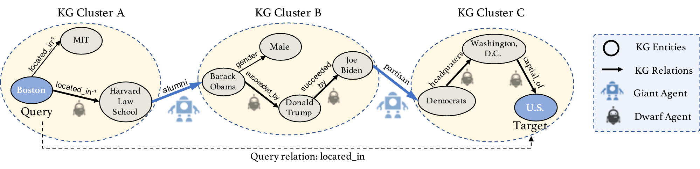

# CURL: Learning to Walk with Dual Agents for Knowledge Graph Reasoning

Pytorch Implementation for AAAI' 2022 paper: Learning to Walk with Dual Agents for Knowledge Graph Reasoning

## Framework Overview
This paper proposed a dual-agent based reinforcement learning approach to tackle the KG reasoning problem. Existing RL-based learning to walk methods rely solely on one entity-level agent to explore large KGs, which works well on finding short reasoning paths, but usually succumb to longer patterns. Hence, we propose to divide large KGs into semantic clusters first, then utilize a cluster-level agent (named Giant) to assist entity-level agent (named Dwarf) and co-explore KG reasoning.  To fulfill the purpose, we design a Collaborative Policy Network and Mutual Reinforcement Reward system to train two agents synchronously. 

<p align="center">

</p>


## Requirements
<!-- To install the various python dependencies (including pytorch) -->
```
pip install -r requirements.txt
```
- python 3.8.5
- scipy 1.6.2
- tqdm 4.62.3
- torch 1.7.1
- numpy 1.19.2


## Training & Testing
The hyperparam configs for each experiments are included in the [configs](https://github.com/RutgersDM/DKGR/tree/master/configs) directory. To start a particular experiment, just do
```
sh run.sh configs/${dataset}.sh
```
where the `${dataset}.sh` is the name of the config file. For example, 
```
sh run.sh configs/nell.sh
```

## Output
The code outputs the evaluation of CURL on the datasets provided. The metrics used for evaluation are Hits@{1,3,5,10,20}, MRR, and MAP.  Along with this, the code also outputs the answers CURL reached in a file.

<!-- ## Citation -->
<!-- If you use our code, please cite the paper
```
@InProceedings{curl2022,
  author    = {Denghui Zhang, Zixuan Yuan, Hao Liu, Xiaodong Lin, Hui Xiong},
  title     = {Learning to Walk with Dual Agents for Knowledge Graph Reasoning},
  booktitle = {Proceedings of the Thirty-Sixth AAAI Conference on Artificial Intelligence (AAAI 2022)},
  month     = {September},
  year      = {2022},
  address   = {Copenhagen, Denmark},
  publisher = {ACL}
}
``` -->


## Acknowledgement
* [MINERVA implementation](https://github.com/shehzaadzd/MINERVA)
